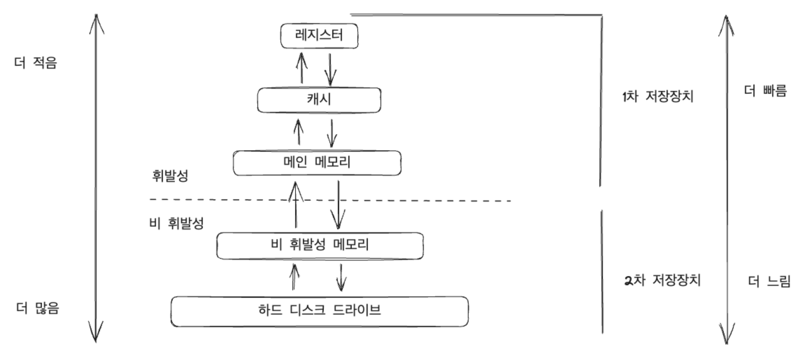

# 1. 서론

#### 이 장의 목표

> * 컴퓨터 시스템의 일반적인 구성과 인터럽트의 역할을 기술한다.
> * 현대 다중 처리기 컴퓨터 시스템의 구성요소에 관해 기술한다.
> * 사용자 모드에서 커널 모드로의 전환에 대해 설명한다.
> * 다양한 컴퓨팅 환경에서 운영체제가 어떻게 사용되는지 논의한다.

### 운영체제가 할 일

프로그램을 실행 시키거나 하드웨어 같은걸 관리한다. 아니면 컴퓨터를 킬 때 로그인 하는것처럼 인증 인가와 같은 보안역할.

#### 사용자 관점

사용자 관점에서는 사용하기만 용이하면 된다. GUI나 CLI에 따라서 인터페이스가 달라지게 된다.

#### 시스템 관점

하드웨어를 잘 관리 하면서 효율적으로 운용하는 것.

#### 운영체제 정의

* 프로그램 실행 하고 사용하는 것.
* 커널이라고도 얘기한다.

### 컴퓨터 시스템의 구성

컴퓨터 구조는 CPU 메모리, 디스크로 구성된다. 이런 애들은 시스템 버스를 통해서 연결돼서 데이터를 주고 받는다.  CPU가 일을 시킨 후 전체적으로 완료되면 `인터럽트` 라는 것을 보내주며 완료된 것을 알게 된다.

예를 들어 아이스크림 심부름을 시킨 후 티비를 보다가 아이스크림을 사가지고 오면 얘기를 해준다. 그게 인터럽트이다.

인터럽트 서비스 루틴 -> 함수 ex) 아이스크림 먹기 위한 껍질을 까고 먹는 행위

Interrupt 한테 고유한 번호들이 있다. List 인덱스가 Interrupt Number다.

**Interrupt 구조**

모든 정보를 저장하고, 현재까지 진행 된 상태를 저장하며 복원할 수 있어야 한다.

> **프로그램 카운터** 다음 연산을 실행할 것을 저장 해둔 것

CPU가 하는 일은 명령어를 처리하는 것인데 인터럽트 신호는 IRL(Interrupt request line)을 감지한다.

최신 운영체제에는 다음과 같은 처리 기능이 필요하다.

1. 중요한 처리 중에 인터럽트 처리를 연기 할 수 있어야 한다.
2. 장치의 적절한 인터럽트 핸들러로 효율적으로 디스패치 할 바업이 필요하다.
3. 운영체제가 우선순위가 높은 인터럽트와 우선순위가 낮은 인터럽트를 구분하고 적절한 긴급도로 대응할 수 있도록 다단계 인트럽트가 필요하다.

CPU에는 2개의 요청 라인이 있다.

* nonMaskable interrupt (마스크 불가능 인터럽트)
  * 이 인터럽트는 절대 중단되면 안된다.
* maskable(마스킹 가능)
  * 이 인터럽트는 중단될 수 있다.

***

### 저장장치 구조

컴퓨터 전원을 켤 때 실행되는 프로그램은 `부트스트랩 프로그램`이며 운영체제를 메모리에 적재하는 역할을 한다.

컴퓨터는 `폰 노이만 구조 시스템` 을 적용하여 명령 -- 실행 사이클은 먼저 메모리로부터 명령을 인출해, 그 명령을 `명령 레지스터`에 저장한다.

1. 메인 메모리는 모든 필요한 프로그램과 데이터를 영구히 저장하기에는 너무 적은 용량을 가지고 있다.
2. 메인 메모리는 이미 언급한 것처럼 전원이 공급되지 않으면 그 내용을 잃어버리는 휘발성 저장장치이다. 즉, 전기가 끊기면 데이터도 잃게 된다.

그래서 대부분의 컴퓨터 시스템은 메인 메모리의 확장으로 `보조저장장치`를 제공한다. 일반적으로 보조저장장치는 `하드 디스크 드라이브(HDD)`와 `비 휘발성 메모리(NVM)`로 프로그램과 데이터 모두를 위한 저장소를 제공한다.

### 입출력 구조

인터럽트 구동 I/O의 형태는 소량의 데이터를 이동하는 데는 좋지만, 대량 데이터 이동에 사용될 때 높은 오버헤드를 유발할 수 있다. 이러한 문제를 해결하기 위해 `직접 메모리 액세스(DMA)`가 사용된다.

## 컴퓨터 시스템 구조

### 단일 처리기 시스템(Single Processor Systems)

단일 코어는 명령을 실행하고 로컬로 데이터를 저장하기 위한 레지스터를 포함하는 구성 요소이다.

### 다중 처리기 시스템(Multiprocessor Systems)

CPU 프로세서가 운영체제 기능 및 사용자 프로세스를 포함한 모든 작업을 수행하는 SMP(symmetric multiprocessing)을 사용한다.

장점은 많은 프로세스를 동시에 실행할 수 있다는 것이다. 그러나 CPU가 독립적이기 때문에 하나는 유휴 상태이고 또 다른 하나는 과부하가 걸려 비효율적일 수 있다.

다중 처리기 시스템을 사용하면 자원을 다양한 프로세스 간에 동적으로 공유할 수 있으며 프로세서 간의 작업 부하 분산을 낮출 수 있다.

**다중 처리기**는 시간이 지남에 따라 발전해왔으며, `다중 코어` 시스템을 포함한다.

### 이중-모드와 다중모드 운용 (Dual-Mode and Multimode Operation)

올바르게 설계된 운영체제는 잘못된 프로그램으로 인해 다른 프로그램 또는 **운영체제 자체가 잘못 실행될 수 없도록 보장**해야한다. 시스템을 올바르게 실행하려면 **운영체제 코드 실행과 사용자-정의 코드 실행을 구분**할 수 있어야 한다.

그래서 운영체제는 `사용자 모드`와 `커널 모드`\[특권 모드(privileged mode)]를 필요로 한다. `모드 비트`라고 하는 하나의 비트가 현재의 모드를 나타내기 위해 컴퓨터 하드웨어에 추가되었다. 이 비트는 커널 모드(0) 또는 사용자 모드(1)을 나타낸다.

사용자 응용을 위하여 실행될 때 시스템은 사용자 모드에 있게 된다. 그러나 사용자 응용이 운영체제로부터 서비스를 요청하면(시스템 콜) 요청을 수행하기 위해서 사용자 모드에서 커널 모드로 전환해야 한다. 하드웨어는 커널 모드에서 시작(부트스트랩 프로그램)하고, 사용자 모드에서 사용자 프로세스(Excel, Word 등등)가 시작된다.

운영체제가 컴퓨터의 제어를 얻을 때마다 항상 커널 모드에 있게 된다. 즉, 운영체제는 커널 모드와 사용자 모드를 무수히 많이 변경해가며 우리가 사용할 수 있도록 한다.

또한 시스템 콜은 하드웨어 의해 하나의 소프트웨어 인터럽트로 취급된다.

### 타이머

운영체제가 CPU에 대한 제어를 유지할 수 있도록 보장해야 한다. 무한 르프에 빠지거나 시스템 서비스 호출에 실패하여, 제어가 운영체제로 복귀하지 않는 경우가 없도록 반드시 방지해야 한다. 운영체제는 이러한 것을 해결하기 위해 `타이머(Timer)`를 사용한다.

## 자원 관리

운영체제는 기본적으로 `자원 관리자`이다. CPU, 메모리, 파일 저장 공간 및 I/O 장치는 운영체제가 관리해야 하는 자원에 속한다.

### 프로세스 관리

프로그램은 CPU에 의해 명령이 실행되지 않으면 아무것도 할 수 없다.

우리는 프로그램 그 자체는 프로세스가 아님을 강조한다. 즉, 하나의 프로그램은 디스크에 저장된 파일의 내용과 같이 수동적 개체지만 프로세스는 다음 수행할 명령을 지정하는 `프로그램 카운터`를 가진 능동적인 개체이다.

> 프로그램 카운터 레지스터 -> 즉 다음에 실행할 것의 주소를 들고 있다.

프로세스의 수행은 반드시 순차적이어야 한다.

* 사용자 프로세스와 시스템 프로세스의 생성과 제거
* CPU에 프로세스와 Thread 스케줄하기
* 프로세스의 일시 중지와 재수행
* 프로세스 동기화를 위한 기법 제공
* 프로세스 통신을 위한 기법 제공

### 메모리 관리

**메인 메모리**는 CPU가 **직접 주소를 지정**할 수 있고, **직접 접근**할 수 있는 **유일한 대량 메모리**이다.

프로그램이 수행되기 위해서는 반드시 절대 주소로 매핑되고 메모리에 적재되어야 한다.

* 메모리의 어느 부분이 현재 사용되고 있으며 어느 프로세스에 의해 사용되고 있는지를 추적해야 한다.
* 필요에 따라 메모리 공간을 할당하고 회수해야 한다.
* 어떤 프로세스들을 메모리에 적재하고 제거할 것인가를 결정해야 한다.
