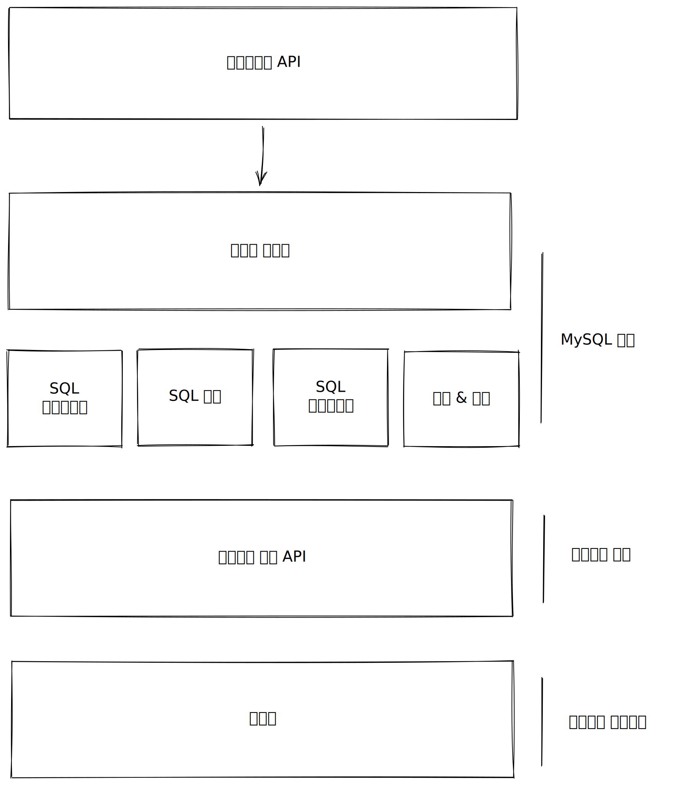

# LSP 리스코프 치환 원칙

### 치환 원칙

S타입의 객체 `o1`과 T타입 객체 `o2`가 있고, T타입을 이용해서 정의한 모든 프로그램 P에서 o2의 자리에 o1을 치환하더라도 P의 행위는 변하지 않는다면, S는 T의 하위 타입이다.

여기서 말하는 것은 `interface`가 될 수도 있고, 추상클래스 혹은 일반 클래스 가 될 수도 있다.

가급적 권장하는 것은 `interface`만 사용하는 것을 권장하고 싶다.\
추상클래스나 일반클래스를 상속받게 되면 부모 클래스가 변경되었을 때 자식 클래스에도 영향이 가기 때문에 `extends` 키워드를 사용하지 않는 것이 좋다.

그림은 interface만 작성하였다.



서비스에서 `Repository`에 `save()` 추상 메서드가 있다고 가정해보자.\
구현체에선 `save()`를 구현하게 될 것이고, 그것이 NOSQL이든 RDBMS든 상관 없이 Service에선 Repository의 `save()`를 호출했을 때의 행위는 변하지 않는다.

### LSP와 아키텍쳐

객체지향이 처음 등장했을 땐 LSP는 상속을 사용하도록 가이드하는 방법으로 간주되었다.\
하지만 시간이 지나면서 LSP는 인터페이스와 구현체에도 적용되는 더 광범위한 소프트웨어 설계 원칙으로 변모되었다.

아키텍처 관점에서 LSP를 이해하는 최선의 방법은 이 원칙을 어겼을 때 무슨 일이 발생하는지 보는 것이 가장 좋다.

### LSP 위배 사례

다양한 택시 파견 서비스를 통합하는 애플리케이션을 만들고 있다고 가정해보자.\
고객은 어느 택시업체인지는 신경쓰지 않고 자신의 상황에 가장 적합한 택시를 찾으면 된다.\
시스템은 rest 서비스를 통해 택시를 고객 위치로 파견한다.

택시기사인 밥을 택시 파견을 보낼 때는 다음과 같다.

```
purplecab.com/driver/Bob
```

시스템은 파견에 필요한 정보를 덧붙인 후, 아래와 같이 PUT 방식을 호출한다.

```
purblecab.com/driver/Bob
        /pickupAddress/주소
        /pickupTime/180
        /destination/ORD
```

이 예제에서 분명한 점은 다양한 택시업체에서 동일한 rest interface를 준수해야 한다는 것이다.

다른 업체에서 프로그래머를 고용했는데, 이들이 명세서를 신중하게 읽지 않고, destination필드를 dest로 축약해서 사용했다고 가정해보자.

이렇게 되면 우리는 이 예외 사항을 처리하는 로직을 추가해야만 한다.\
예를 들어 if문을 추가해서 두 개의 택시 업체를 따로 따로 처리를 해야되는 상황이 발생한다.\
또한 다른 회사를 또 인수하게 되면 또 그 회사를 위한 if문을 추가해야만 하는 상황이 생기게 된다.

또 다른 예를 들었을 때 우리는 회사에서 퇴사를 하게 되면 인수인계 문서를 작성하고, 그것을 후임자에게 준다.\
그럼 후임자는 그 문서를 읽고 내가 하던 업무를 이어서 하게된다.\
그렇게 됐을 때 내가 퇴사를 하더라도 회사에 지장이 생기지 않게된다.

하지만, 내가 퇴사를 할 때 후임자에게 아무것도 주지않고, 혹은 후임자가 아예 없을 경우엔 회사 업무에 지장이 생기게 된다.

### 결론

LSP는 아키텍처 수준까지 확장할 수 있으며, **반드시 확장해야만 한다.**\
치환 가능성을 위배하게 된다면 상당량의 별도 코드를 추가해야 되는 상황이 생길 수 있다.

확장이 생길 경우 OCP의 원칙처럼 변경을 하는게 아니라 확장이 가능하도록 설계하여 변경을 하지 않게 해야한다.
